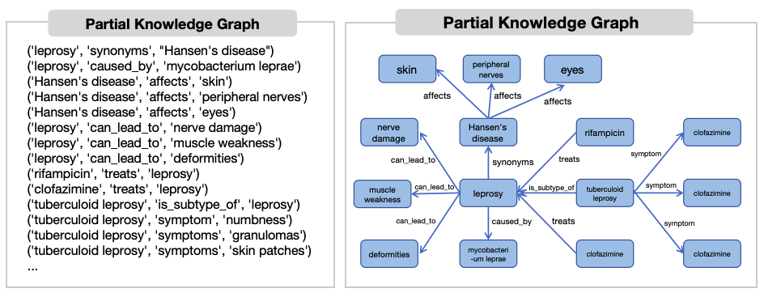

# Dynamic co-Augmentation between Knowledge Graphs and Large Language Models for Answering Long-tail Medical Knowledge Questions

## Overview


## Dependency

---

1、To fully run this project, one is recommended to install the requirement packages listed in requirements.txt.

```python
pip install -r requirements.txt
```

2、Place the [`medcpt` model](https://github.com/ncbi/MedCPT) in the `MedCPT` directory.

3、Create a `.env` file and set the `OPENAI_API_KEY` value.

## Offline KG construction

---

- **crawler**: PubMed crawler tool. Please set the `SEARCH_QUERY` before running
- **deal**: Related to creating the KG and generating embeddings for entities
- **pubtator**: PubTator tool
- **pubtatorNer**: Generates relation extraction methods

###### Visualization of the Constructed Knowledge Graph

---



## Online knowledge retrieval

---

- **config**: Configuration file for retrieval parameters
- **draft**: Draft assertions, processed using GPT's batch method
- **threeStageBeam**: Three-stage beam search reranking method
- **tool**: Three-stage beam search reranking method
  
